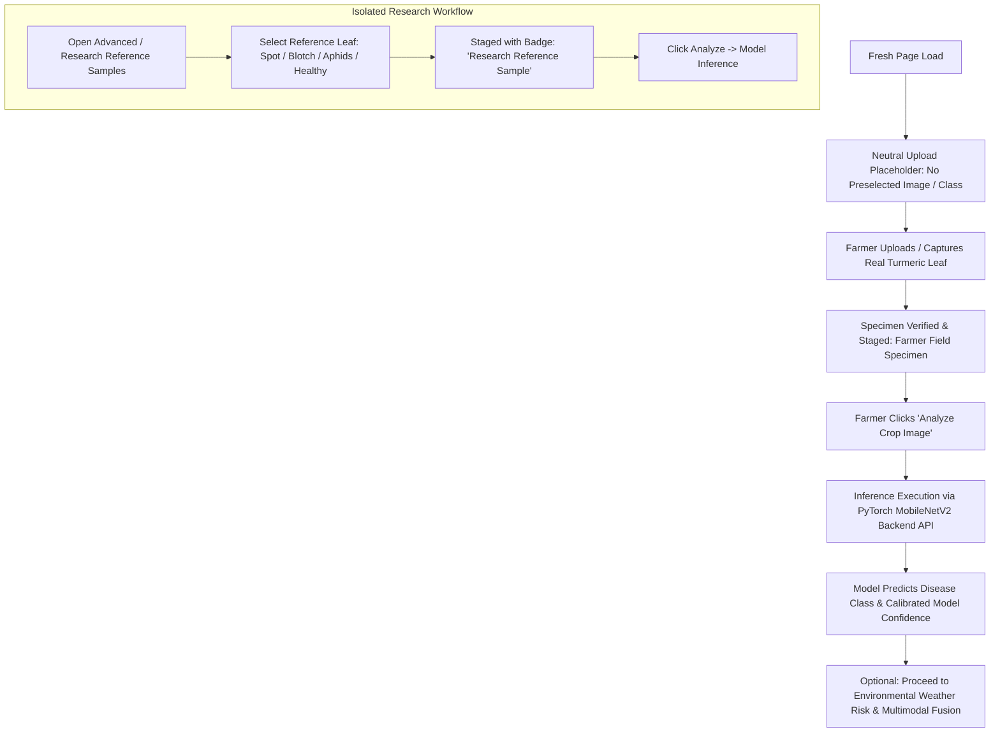

# TurmeriCare AI — Disease Detection Farmer Workflow & Neutral Initial State Audit

## Document Metadata
- **System**: TurmeriCare AI (Multimodal Foliar Pathology & Microclimate Epidemiological Decision Support)
- **Module**: Disease Detection (`src/pages/DiseaseDetectionPage.tsx`, `src/context/AppContext.tsx`, `src/components/layout/Header.tsx`, `src/utils/translations.ts`)
- **Target Audience**: Tamil Nadu Turmeric (*Curcuma longa*) Farmers & Agricultural Researchers
- **Audited On**: 2026-09-18
- **Status**: **VERIFIED & PRODUCTION AUDIT PASSED**

---

## 1. Executive Summary & Core Principle

### The Farmer-First Scientific Principle
> **FARMER UPLOADS IMAGE FIRST. AI PREDICTS CLASS SECOND. NEVER PRESELECT A DISEASE FOR THE FARMER.**

Previously, the Disease Detection UI loaded on fresh start with a preselected reference image (*Blotch Leaf*), an active disease class label, and an unearned initial confidence metric (e.g. 94.6%). This implied that the system or farmer had already determined the disease prior to visual model execution.

The workflow has been completely rectified to enforce a strict neutral initial state for the farmer-facing workflow while preserving reference sample benchmarking tools under an isolated research section.



---

## 2. Specific Audit Verifications

### A. Initial State (No Leaf)
- **Visual Image Area**: Displays a clean, dedicated dashed upload dropzone with a prominent upload icon and bilingual instructions.
  - **English**: `"Upload or capture a turmeric leaf photo to begin analysis."`
  - **Tamil**: `"ஆய்வைத் தொடங்க மஞ்சள் இலைப் புகைப்படத்தைப் பதிவேற்றவும் அல்லது படம் எடுக்கவும்."`
- **Identified Class**: Shows `"No analysis yet"` / `"இன்னும் ஆய்வு செய்யப்படவில்லை"`.
- **Model Confidence**: Shows `"No analysis yet"` / `"இன்னும் ஆய்வு செய்யப்படவில்லை"`. No fake or prefilled percentages are rendered.
- **Badge Status**: Displays `Awaiting Leaf Photo Analysis` / `இலைப்பட ஆய்வுக்காக காத்திருக்கிறது` (neutral slate status).

### B. Farmer Upload Workflow
- When a farmer uploads an image file (JPG, JPEG, PNG, WEBP up to 20 MB):
  - The photo preview is displayed with the badge: `Farmer Field Specimen: [filename]`.
  - The disease class remains unpredicted until the farmer clicks **Analyze Crop Image** / **படத்தை ஆய்வு செய்**.
  - Clicking **Analyze Crop Image** triggers the live backend inference (`POST http://localhost:8000/api/predict`) or tensor processing, updates the prediction, calculates confidence, and unlocks history saving.

### C. Top Navigation Header Neutralization
- The top header navigation no longer displays a preselected disease class such as `FIELD SAMPLE: Blotch (Blotch Leaf)`.
- It now displays a neutral field indicator:
  - **English**: `FIELD: Not selected`
  - **Tamil**: `வயல்: தேர்வு செய்யப்படவில்லை`

### D. Isolation of Research Reference Samples
- Reference samples (*Leaf Blotch, Leaf Spot, Aphids, Healthy*) have been relocated inside the collapsible **Advanced / Research Reference Samples** (`ஆராய்ச்சி & மாதிரி தேர்வுக் கருவிகள்`) drawer.
- When a researcher selects a sample:
  - It is clearly badged: `Research Reference Sample: [Disease]`.
  - It does NOT populate confidence or prediction until the researcher triggers **Analyze Crop Image**.
  - It is never selected by default when a farmer navigates to the page.

---

## 3. Bilingual State Matrix

| State / Element | English UI String | Tamil UI String | Validation Status |
|---|---|---|:---:|
| **Initial Upload Prompt** | Upload or capture a turmeric leaf photo to begin analysis. | ஆய்வைத் தொடங்க மஞ்சள் இலைப் புகைப்படத்தைப் பதிவேற்றவும் அல்லது படம் எடுக்கவும். | PASS |
| **Identified Class (Empty)** | No analysis yet | இன்னும் ஆய்வு செய்யப்படவில்லை | PASS |
| **Model Confidence (Empty)** | No analysis yet | இன்னும் ஆய்வு செய்யப்படவில்லை | PASS |
| **Header Field Status** | FIELD: Not selected | வயல்: தேர்வு செய்யப்படவில்லை | PASS |
| **Research Sample Badge** | Research Reference Sample: [Disease] | ஆராய்ச்சி குறிப்பு மாதிரி: [நோய்] | PASS |
| **Farmer Upload Badge** | Farmer Field Specimen: [filename] | விவசாயி கள இலைப்படம்: [filename] | PASS |

---

## 4. Test Suite Execution & Build Verification

```
================================================================
TURMERICARE AI — STAGE 5D UI INTEGRATION TEST SUITE
================================================================

[PASS] TEST_A_B: Research risk engine output is correctly structured for UI consumption
[PASS] TEST_C: Disease-specific pathways output distinct biological rationales and disease identifiers
[PASS] TEST_D: Manual input slider parameters convert into a physically consistent 336-hour buffer
[PASS] TEST_E: Historical reanalysis presets (Erode, Dharmapuri) are loaded with valid 336h records
[PASS] TEST_F: Incomplete or missing environmental records are safely rejected
[PASS] TEST_G: Dew proxy is strictly disclaimed as an atmospheric condensation proxy
[PASS] TEST_H: Data source attribution strictly distinguishes manual inputs from historical reanalysis
[PASS] TEST_I: Crop stage / DAP is reflected as contextual biological information
[PASS] TEST_J_K: Research engine output contains zero uncalibrated probability or accuracy claims
[PASS] TEST_L: Fallback calculator (riskCalculator.ts) remains 100% operational
[PASS] TEST_M_N: Agronomic recommendations are structured and available for extension guidance
[PASS] TEST_P: Initial unanalyzed state strings are strictly defined in both English and natural Tamil
[PASS] TEST_Q: Research reference samples remain accessible for benchmarking while isolated from default farmer flow

================================================================
UI INTEGRATION TESTS: 13 PASSED / 0 FAILED (TOTAL 13)
ALL INTEGRATION TESTS PASSED: true
================================================================
```

### Production Build
- `npm run build` executed in 5.29s with 0 errors.
- Visual headless browser session recorded and verified: `disease_neutral_flow_1789723186136.webp`.
