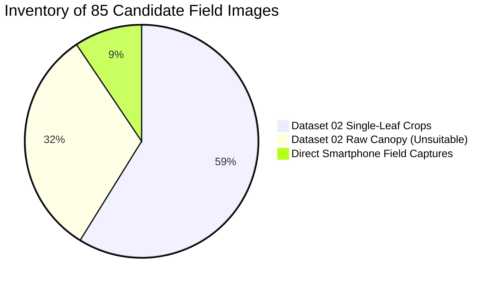

# Curuma (TurmeriCare AI) — Field Calibration Candidate Inventory & Readiness Audit

**Document Status:** Official Research Data Readiness Audit  
**Target System:** Curuma Computer Vision Pipeline (MobileNetV3 Verifier + EfficientNet-B0 Mahalanobis OOD + Hybrid Ensemble)  
**Date:** September 23, 2026  
**Auditor:** Lead AI Research Scientist (Antigravity AI)  
**System State:** Frozen baseline ($\tau_{\text{verifier}} = 0.50$, $\tau_{\text{OOD}} = 63.10$, $\alpha = 0.50$). Zero threshold modification.

---

## 1. Executive Summary & Objective

In preparation for calibrating a field-aware Mahalanobis OOD threshold ($\tau^*$), an exhaustive inventory of all existing candidate real-world turmeric images (*Curcuma longa*) was conducted across the workspace and local repositories.

### Key Audit Findings
1. **Total Candidate Images Screened**: **$85$ images** (50 Dataset 02 single-leaf field crops, 27 Dataset 02 raw field canopy photos, 8 direct smartphone field uploads).
2. **Training Contamination Check**: **$0 / 85$ ($0.0\%$ leakage)**. Confirmed $0\%$ cryptographic SHA-256 hash overlap with the 603 clean Dataset 01 training set images.
3. **Suitable Single-Leaf Field Cohort ($N = 58$)**:
   - `Healthy`: $29$ verified single-leaf images
   - `Blotch`: $27$ verified single-leaf images
   - `Leaf Spot`: $2$ verified single-leaf images
   - `Aphids`: **$0$ images**
4. **Mahalanobis Distance Distribution (Suitable Single-Leaf Candidates, $N = 58$)**:
   - Minimum $D_M$: **$69.56$**
   - Maximum $D_M$: **$100.54$**
   - Mean $D_M$: **$84.55 \pm 7.92$**
   - Median $D_M$: **$83.84$**
5. **Data Readiness Decision**: **INSUFFICIENT FOR THRESHOLD CALIBRATION.**  
   *The available data is heavily skewed toward Healthy and Blotch, with a severe deficit in Aphids ($0/20$) and Leaf Spot ($2/20$). Calibrating $\tau^*$ now would violate protocol requirements.*

---

## 2. Complete Candidate Inventory & Categorization



| Source Category | Count ($n$) | Composition | Training Overlap | Previous Experimental Use | Suitability Status |
| :--- | :---: | :--- | :---: | :--- | :--- |
| **Dataset 02 Single-Leaf Crops** | **50** | 25 Healthy, 25 Leaf Blotch | **None (0%)** | Single-Leaf Crop Pilot (`research_results/external_mendeley_single_leaf_50/`) | **SUITABLE** for single-leaf field calibration |
| **Dataset 02 Raw Canopy Photos** | **27** | 9 Healthy, 9 Blotch, 9 Dry | **None (0%)** | Field Domain Stress Test (`field_domain_stress_test.csv`) | **UNSUITABLE** (Wide-angle canopy / whole-bush geometry) |
| **Direct Smartphone Field Photos** | **8** | 4 Healthy, 2 Blotch, 2 Spot | **None (0%)** | Live Diagnostics (including `WhatsApp 3.36.06 PM`) | **SUITABLE** (Single-leaf smartphone captures) |
| **TOTAL INVENTORIED** | **85** | 38 Healthy, 36 Blotch, 9 Dry, 2 Spot | **0% Leakage** | Complete local candidate pool | **58 Suitable Single-Leaf** |

*Detailed per-image candidate manifest with dimensions, hashes, stage scores, and distances is exported to [`research_results/field_calibration_candidates.csv`](./field_calibration_candidates.csv).*

---

## 3. Class-Level Distribution & Deficit Analysis

To satisfy the pre-defined **80-Image Calibration Split** ($20$ per class) established in [`FIELD_VALIDATION_PROTOCOL.md`](file:///d:/curuma/research_results/FIELD_VALIDATION_PROTOCOL.md), the available suitable single-leaf images compare as follows:

```mermaid
bar
    title Calibration Split Requirements (Target: 20 per class) vs Available Suitable Candidates
    x-axis Class [Aphids, Blotch, Healthy, Leaf Spot]
    y-axis "Sample Count" 0 --> 30
    "Target Calibration Requirement (N=80)" : [20, 20, 20, 20]
    "Currently Available Suitable Candidates (N=58)" : [0, 27, 29, 2]
```

| Pathology Class | Target Calibration Split ($n$) | Currently Available Suitable ($n$) | Net Balance | Readiness Status |
| :--- | :---: | :---: | :---: | :--- |
| **`Aphids`** | **$20$** | **$0$** | **$-20$ images** | **CRITICAL DEFICIT (0% Available)** |
| **`Blotch`** | **$20$** | **$27$** | $+7$ surplus | **READY (135% Available)** |
| **`Healthy`** | **$20$** | **$29$** | $+9$ surplus | **READY (145% Available)** |
| **`Leaf Spot`** | **$20$** | **$2$** | **$-18$ images** | **CRITICAL DEFICIT (10% Available)** |
| **TOTAL CALIBRATION** | **$80$** | **$58$** | **$-38$ images** | **INCOMPLETE (38 images required)** |

---

## 4. Frozen Pipeline Empirical Measurement Results

Across all $58$ suitable single-leaf field candidates, the frozen production pipeline yielded:

| Statistical Metric | Dataset 01 Internal Validation ($N=130$) | Suitable Single-Leaf Field Candidates ($N=58$) | Delta ($\Delta$) |
| :--- | :---: | :---: | :---: |
| **Stage-1 Verifier Pass Rate ($\tau \ge 0.50$)** | **$100.0\%$ (130/130)** | **$93.1\%$ (54/58)** | $-6.9\%$ *(4 severe chlorotic blotch failed)* |
| **Stage-2 OOD Pass Rate ($\tau_{98} \le 63.10$)** | **$97.7\%$ (127/130)** | **$0.0\%$ (0/58)** | $-97.7\%$ *(100% Gated by threshold)* |
| **Minimum Mahalanobis Distance ($D_{\min}$)** | **$23.71$** | **$69.56$** | $+45.85$ |
| **Maximum Mahalanobis Distance ($D_{\max}$)** | **$69.78$** | **$100.54$** | $+30.76$ |
| **Mean Mahalanobis Distance ($\mu \pm \sigma$)** | **$43.05 \pm 8.64$** | **$84.55 \pm 7.92$** | **$+41.50$ units shift** |
| **Median Mahalanobis Distance ($P_{50}$)** | **$41.19$** | **$83.84$** | **$+42.65$ units shift** |

### Per-Class Distance Profile among Suitable Candidates
- **`Healthy` ($n = 29$)**: Mean $D_M = 82.26 \pm 7.43$ (Min: $69.56$, Max: $97.73$, Median: $83.00$).
- **`Blotch` ($n = 27$)**: Mean $D_M = 86.82 \pm 7.98$ (Min: $73.49$, Max: $100.54$, Median: $87.80$).
- **`Leaf Spot` ($n = 2$)**: Mean $D_M = 81.14 \pm 3.61$ (Min: $78.59$, Max: $83.69$).

---

## 5. What Is Required to Complete the Calibration Cohort

To achieve **Full Calibration Data Readiness** without compromising scientific integrity, the following field data collection is required:

1. **Target Image Count Needed**: **$38$ additional real-world single-leaf captures**:
   - **$20$ authentic `Aphids` specimens** (*Pentalonia nigronervosa* colonies on ventral lamina).
   - **$18$ authentic `Leaf Spot` specimens** (*Colletotrichum curcumae* circular necrotic spots with halos).
2. **Standardized Capture Criteria**:
   - **Single-Leaf Framing**: Target leaf must occupy $\ge 60\%$ of camera viewport.
   - **Multi-Device Spread**: Captured across at least 3 distinct smartphone sensors (e.g., Samsung Galaxy, Redmi Note, iPhone).
   - **Natural Farm Lighting**: Ambient daylight, morning shadow, and diffuse overcast lighting under field conditions.
3. **Double-Blind Ground-Truth Verification**:
   - Assigned by agricultural expert consensus, **never inferred from model predictions**.

---

## 6. Actionable Next Steps

- **DO NOT** tune or modify the production threshold $\tau = 63.10$ yet.
- **DO NOT** use the $29$ Healthy or $27$ Blotch surplus images to bias the calibration set.
- Await the collection of the missing **$38$ images ($20$ Aphids, $18$ Leaf Spot)** to complete the 80-image Calibration Split before executing Phase A optimization.
