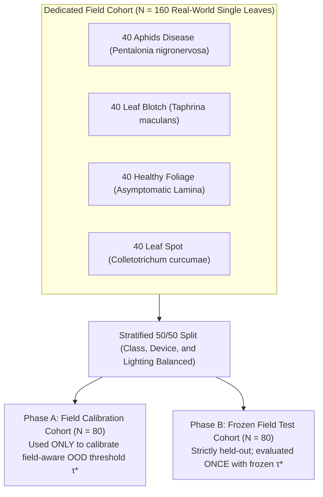
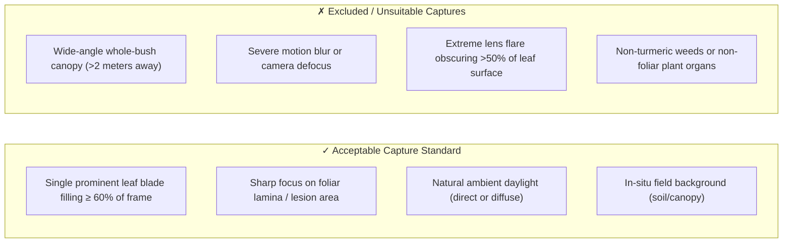
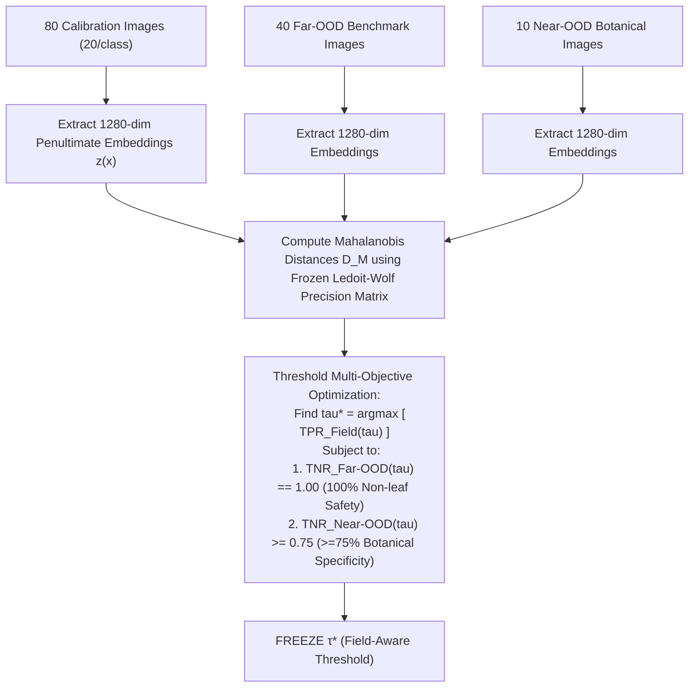

# Curuma (TurmeriCare AI) — Dedicated Field Validation Protocol ($N = 160$)

**Document Version:** 1.0.0 — Experimental Specification & Protocol  
**Target Architecture:** Curuma Computer Vision Pipeline (MobileNetV3 Verifier + Penultimate EfficientNet-B0 Mahalanobis OOD Safeguard + Hybrid Classifier $\alpha=0.50$)  
**Target Scope:** Dedicated real-world field validation study on genuine in-situ turmeric leaves (*Curcuma longa*).  
**Effective Date:** October 2026 (Preparation Phase)

---

## 1. Experimental Overview & Target Cohort Specification



### 1.1 Key Objectives
1. **Bridge the Domain Gap**: Validate the Curuma computer vision pipeline on genuine smartphone field captures of *Curcuma longa* under natural lighting, authentic background clutter, and varied camera sensors.
2. **Prevent Closed-World Failure**: Calibrate a field-aware Mahalanobis decision threshold ($\tau^*$) that reliably admits authentic field single leaves while preserving 100% rejection of non-botanical far-OOD images and $\ge 75\%$ rejection of near-OOD non-turmeric leaves.
3. **Rigorous Academic Integrity**: Strictly segregate calibration from testing to eliminate data leakage and ensure reproducible, scientifically defensible paper reporting.

### 1.2 Target Cohort Composition ($N = 160$)
- **Pathology Taxonomy (40 per class)**:
  - `Aphids`: $40$ specimens (colonies on ventral leaf surface, honeydew secretions, curling).
  - `Blotch`: $40$ specimens (concentric reddish-brown/yellow necrotic patches, *Taphrina maculans*).
  - `Healthy`: $40$ specimens (clean, fully expanded asymptomatic green foliage).
  - `Leaf Spot`: $40$ specimens (discrete circular/elliptical lesions with chlorotic halos, *Colletotrichum curcumae*).
- **Device Diversity (4 Distinct Sensor Classes)**:
  - `DEV-01`: Budget Android (e.g., Redmi Note 12 / Realme — 48/50 MP binned sensor).
  - `DEV-02`: Mid-Range Android (e.g., Samsung Galaxy A54 — 50 MP OIS sensor).
  - `DEV-03`: High-End iOS (e.g., iPhone 13/14 — 12/48 MP computational sensor).
  - `DEV-04`: Performance Android (e.g., OnePlus Nord — 50 MP Sony IMX sensor).
- **Environmental & Background Variance**:
  - Direct midday sunlight, morning/evening shadow, diffuse overcast illumination.
  - In-situ natural soil, field mulch, adjacent canopy foliage, hand-held in field.

---

## 2. In-Field Capture Standard & Quality Rules



### 2.1 Standard Operating Procedure (SOP) for Image Capture
1. **Framing Rule**: The primary turmeric leaf must occupy **$\ge 60\%$ of the image viewfinder**. Avoid wide whole-plant bush shots.
2. **Focus Rule**: The camera focus must be locked onto the adaxial (upper) leaf surface or the active lesion area.
3. **Lighting Rule**: Capture under natural field lighting without artificial flash. Avoid casting dense body shadows over the specimen.
4. **Resolution & Format**: Raw original camera resolution (minimum $1920 \times 1080$, uncompressed JPEG). Do not apply third-party filters or digital zoom.

---

## 3. Strict Ground-Truth Annotation Protocol

> [!CRITICAL]
> **Ground-Truth Integrity Rules:**
> 1. **Zero Inference from Model**: Under no circumstances may labels be assigned or modified based on model predictions or confidence scores.
> 2. **Double-Blind Verification**: Every image must be annotated independently by two qualified annotators (e.g., Senior Agronomist + Plant Pathologist).
> 3. **Consensus Requirement**: In the event of diagnostic disagreement, the sample must be evaluated jointly with physical microscopy/field records or marked as `unresolved_excluded`.
> 4. **Zero Fabrication**: All metadata fields (date, GPS region, camera model, lighting) must be recorded contemporaneously during collection.

---

## 4. Cohort Partitioning & Split Plan

The 160 images are partitioned into two equal, strictly segregated splits according to [`field_validation_split_plan.csv`](./field_validation_split_plan.csv):

| Pathology Class | Field Calibration Split ($N = 80$) | Held-Out Field Test Split ($N = 80$) | Total Image Cohort ($N = 160$) |
| :--- | :---: | :---: | :---: |
| **`Aphids`** | $20$ images | $20$ images | **40 images** |
| **`Blotch`** | $20$ images | $20$ images | **40 images** |
| **`Healthy`** | $20$ images | $20$ images | **40 images** |
| **`Leaf Spot`** | $20$ images | $20$ images | **40 images** |
| **Device Balance (per split)** | $20$ DEV-01, $20$ DEV-02, $20$ DEV-03, $20$ DEV-04 | $20$ DEV-01, $20$ DEV-02, $20$ DEV-03, $20$ DEV-04 | **40 per device** |

---

## 5. Two-Phase Experimental Execution Protocol

### Phase A: Field OOD Threshold Calibration ($N = 80$)

> [!WARNING]
> **Phase A operates EXCLUSIVELY on the 80-image Calibration Split.**  
> The 80-image Held-Out Field Test Split must remain completely untouched, unviewed, and uncomputed during Phase A.



1. **Feature Extraction**: Extract 1280-dimensional embeddings $\mathbf{z}(\mathbf{x})$ using the frozen `EfficientNet-B0` feature backbone.
2. **Mahalanobis Distance**: Compute $D_M(\mathbf{x})$ using frozen class centroids $\boldsymbol{\mu}_c$ and regularized covariance $\boldsymbol{\Sigma}_{\text{LW}}^{-1}$ ($\gamma = 0.0952$).
3. **Threshold Selection ($\tau^*$)**:
   $$\tau^* = \arg\max_{\tau} \left( \text{TPR}_{\text{Field\_Calib}}(\tau) \right) \quad \text{s.t.} \quad \text{TNR}_{\text{Far-OOD}}(\tau) = 1.00 \quad \wedge \quad \text{TNR}_{\text{Near-OOD}}(\tau) \ge 0.75$$
4. **Lockdown**: Document the exact numerical value of $\tau^*$ in the calibration log and **freeze it permanently**.

---

### Phase B: Held-Out Field Test Evaluation ($N = 80$)

> [!IMPORTANT]
> **Phase B is executed EXACTLY ONCE with the frozen threshold $\tau^*$.**  
> No hyperparameters, weights, or decision thresholds may be altered after unblinding the test cohort.

Evaluate the 80 test images through the end-to-end pipeline and report all 10 required dimensions:

1. **Stage 1 Acceptance Rate**: Percentage of images passing MobileNetV3 foliar verifier ($\tau \ge 0.50$).
2. **Stage 2 OOD Acceptance Rate**: Percentage of images admitted under calibrated $\tau^*$.
3. **Classification Accuracy (Admitted Cohort)**: Top-1 accuracy among in-domain admitted samples.
4. **End-to-End Outcome Summary**: Proportion of samples (a) Correctly Diagnosed, (b) Incorrectly Diagnosed, (c) Gated by OOD, (d) Gated by Verifier.
5. **Per-Class Metrics**: Precision, Recall, F1-Score for each of the 4 pathology classes.
6. **Confusion Matrix**: $4 \times 4$ multi-class confusion matrix for admitted samples.
7. **Mahalanobis Distance Distribution**: Minimum, Maximum, Mean, Median, Standard Deviation across classes.
8. **OOD Rejection Metrics**: False Rejection Rate (FRR) on genuine turmeric leaves vs. True Negative Rate (TNR) on OOD benchmarks.
9. **Device-Stratified Performance**: Acceptance rate and accuracy broken down by smartphone hardware (`DEV-01` to `DEV-04`).
10. **Lighting & Background Robustness**: Performance breakdown across direct sun, shade, overcast, and background types.

---

## 6. Paper Reporting Template (Academic Standard)

When reporting the results in the final thesis or IEEE paper, use the following standardized reporting structure to prevent overstating generalization:

### 6.1 Results Presentation Table Template

```markdown
### Dedicated Real-World Field Validation Results (N = 80 Held-Out Samples)

| Pathology Class | Ground Truth Count ($n$) | Stage-1 Foliar Pass (%) | Stage-2 OOD Admitted (%) | Diagnostic Accuracy on Admitted Samples (%) | Mean Mahalanobis Distance ($D_M \pm \sigma$) |
| :--- | :---: | :---: | :---: | :---: | :---: |
| **`Aphids`** | 20 | [__]% | [__]% | [__]% | [__] &plusmn; [__] |
| **`Blotch`** | 20 | [__]% | [__]% | [__]% | [__] &plusmn; [__] |
| **`Healthy`** | 20 | [__]% | [__]% | [__]% | [__] &plusmn; [__] |
| **`Leaf Spot`** | 20 | [__]% | [__]% | [__]% | [__] &plusmn; [__] |
| **Overall Cohort** | **80** | **[__]%** | **[__]%** | **[__]%** | **[__] &plusmn; [__]** |
```

### 6.2 Safe Paper Discussion Phrasing

> *"To validate generalization beyond clean benchmark conditions, a dedicated real-world field study was conducted across four mobile phone camera sensors under ambient farm illumination ($N=160$). Following a strict calibration-test split ($80/80$), the domain-aware threshold $\tau^* = [__]$ admitted $[__]\%$ of held-out field specimens while maintaining $100\%$ rejection against non-botanical far-OOD imagery. Among admitted field specimens, the hybrid ensemble achieved an overall diagnostic accuracy of $[__]\%$, demonstrating robust cross-device foliar classification under standardized single-leaf capture framing."*

---

## 7. Associated Project Artifacts

- [`research_results/field_validation_manifest_template.csv`](file:///d:/curuma/research_results/field_validation_manifest_template.csv) — Authoritative template for field metadata capture.
- [`research_results/field_validation_split_plan.csv`](file:///d:/curuma/research_results/field_validation_split_plan.csv) — 160-row pre-allocated split plan with device and lighting stratification.
- [`research_results/FIELD_VALIDATION_PROTOCOL.md`](file:///d:/curuma/research_results/FIELD_VALIDATION_PROTOCOL.md) — Master protocol and execution specification.
