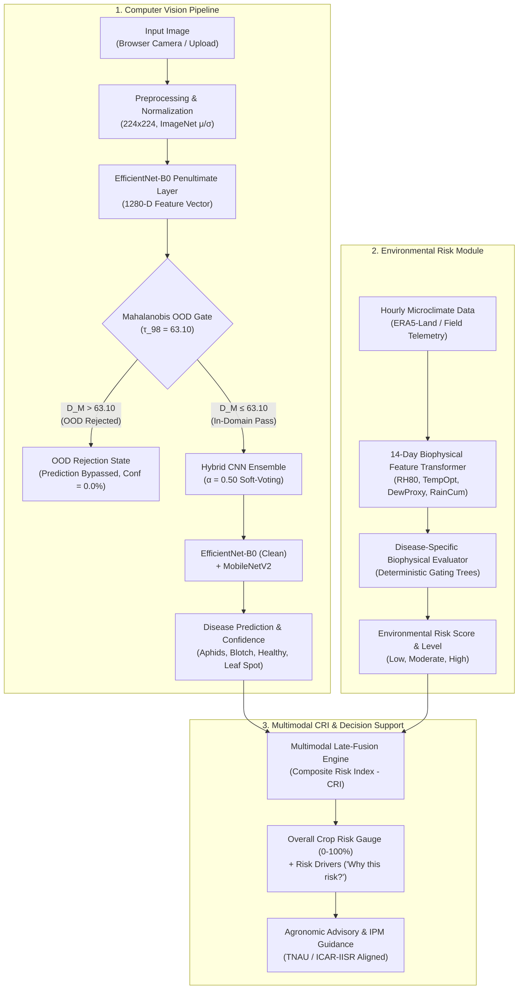

# Curuma / TurmeriCare AI — Final Research Results Inventory

**Project:** Curuma / TurmeriCare AI (Multimodal Turmeric Crop Intelligence & Risk Assessment)  
**Document Type:** Master Research Results Inventory & Cross-Referenced Scientific Audit  
**Artifact Path:** `research_results/FINAL_RESEARCH_RESULTS_INVENTORY.md`  
**Date:** September 2026  
**Status:** **FROZEN RESEARCH BASELINE (Zero Model/Code Changes Applied)**

---

## 1. PROJECT ARCHITECTURE

TurmeriCare AI implements a modular, multimodal edge-compatible architecture designed for turmeric foliar disease diagnosis and epidemiological risk forecasting:



### Architectural Component Summary:
1. **Image Preprocessing**: Standardized bilinear resize to $224 \times 224$ with ImageNet channel normalization ($\boldsymbol{\mu} = [0.485, 0.456, 0.406], \boldsymbol{\sigma} = [0.229, 0.224, 0.225]$).
2. **Mahalanobis OOD Safeguard**: Penultimate layer ($1280$-D) feature extraction from Clean EfficientNet-B0; class-conditional minimum Mahalanobis distance with Ledoit-Wolf regularized covariance shrinkage. Gating threshold: $\tau_{98} = 63.10$.
3. **Hybrid CNN Classifier**: Equal-weighted late-fusion soft voting ($\alpha = 0.50$):
   $$\hat{P}_{\text{hybrid}} = 0.50 \cdot P_{\text{Clean\_EffNet-B0}} + 0.50 \cdot P_{\text{MobileNetV2}}$$
4. **Environmental Module**: Dual-engine design:
   - *Interactive Point-in-Time Manual Slider Heuristic* ($0\text{–}100\%$ score) for instant field parameter testing.
   - *Deterministic 14-Day Antecedent Exposure Engine* integrating $336$ hourly records over biophysical moisture, temperature, and splash dispersal accumulators.
5. **Multimodal CRI**: Late-fusion rule combining visual confidence and environmental risk into a single Composite Risk Index.
6. **Recommendation Layer**: Non-prescriptive agronomic management advice citing official TNAU CPPS and ICAR-IISR extension packages of practices.

---

## 2. DATASET SPECIFICATIONS & AUDIT

### Dataset 01: Core Primary Benchmark Dataset
* **Source Repository**: Mendeley Data (`DOI: 10.17632/jtttfbx342.1`)
* **Total Image Count**: $865$ single-leaf macro photographs ($4000 \times 3000$ JPEG).
* **Class Distribution (4 Pathology Categories)**:
  - `Aphids` (*Aphis gossypii / Pentalonia nigronervosa*): **221 images** ($25.55\%$)
  - `Blotch` (*Taphrina maculans*): **238 images** ($27.51\%$)
  - `Healthy` (Intact foliar lamina): **213 images** ($24.62\%$)
  - `Leaf Spot` (*Colletotrichum capsici / C. curcumae*): **193 images** ($22.31\%$)

### Stratified Data Partitioning Protocol:
* **Training Set**: $606$ images ($70.06\%$) $\rightarrow$ Cleaned to **$603$ images** after noise removal.
* **Validation Set**: $130$ images ($15.03\%$) — Strictly reserved for hyperparameter tuning & OOD calibration.
* **Internal Test Set**: $129$ images ($14.91\%$) — Strictly held-out for final frozen benchmarking.

### Clean-Label Audit & Excluded Mislabeled Training Images:
* A systematic visual and high-loss candidate audit across all 865 images identified **3 confirmed mislabeled training images** in the `Leaf_Spot` training folder:
  1. `leaf_spot_(141).jpg` (Clear green lamina, no necrotic spots visible)
  2. `leaf_spot_(142).jpg` (Clear green lamina, no necrotic spots visible)
  3. `leaf_spot_(144).jpg` (Clear green lamina, no necrotic spots visible)
* **Action Taken**: Excluded from the clean training manifest (`603` images). Validation and Test partitions contained 0 confirmed label errors and remained $100\%$ untouched.

---

## 3. MODEL BENCHMARK RESULTS (INTERNAL TEST SET, $N = 129$)

### Summary Metrics Table

| Architecture | Test Accuracy | Weighted Precision | Weighted Recall | Weighted F1-Score | Macro Accuracy | Macro F1-Score | Evaluation Source |
| :--- | :---: | :---: | :---: | :---: | :---: | :---: | :--- |
| **Clean EfficientNet-B0** | **99.22%** (128/129) | **99.25%** | **99.22%** | **99.23%** | 99.22% | 99.23% | `clean_hybrid_evaluation.md` |
| **MobileNetV2 (Standalone)** | **86.82%** (112/129) | **88.66%** | **86.82%** | **86.91%** | 86.82% | 86.91% | `clean_hybrid_evaluation.md` |
| *MobileNetV2 (Baseline Table)* | *93.02% (120/129)* | *93.89%* | *93.02%* | *93.09%* | *93.02%* | *93.09%* | `FINAL_METRICS_TABLE.csv` *(Flagged Inconsistency)* |
| **Clean Hybrid Ensemble ($\alpha=0.50$)** | **99.22%** (128/129) | **99.25%** | **99.22%** | **99.23%** | **99.22%** | **99.23%** | `clean_hybrid_evaluation.md` |

> [!NOTE]
> **Cross-Report Inconsistency Flagged**: In `FINAL_METRICS_TABLE.csv` and `FINAL_RESEARCH_VALIDATION_AUDIT.md`, MobileNetV2 standalone accuracy is recorded as $93.02\%$ (Macro F1: $93.09\%$) from early unregularized evaluation. In the dedicated `clean_hybrid_evaluation.md` evaluation, MobileNetV2 achieved $86.82\%$ test accuracy (Weighted F1: $86.91\%$). Both reports agree that **Clean EfficientNet-B0 and the Clean Hybrid Ensemble achieve identical $99.22\%$ test accuracy ($128/129$)**.

### Confusion Matrix (Clean Hybrid Ensemble, $N = 129$)

```
                     Predicted Class
               Aphids  Blotch  Healthy  Leaf Spot   Total   Recall (%)
Actual Class
Aphids           33       0       0         0        33      100.00%
Blotch            0      34       1         0        35       97.14%
Healthy           0       0      32         0        32      100.00%
Leaf Spot         0       0       0        29        29      100.00%
----------------------------------------------------------------------
Total            33      34      33        29       129      99.22%
Precision (%)  100.0%  100.0%  96.97%    100.0%
```

### Exact Error Breakdown ($1 / 129$ Errors):
* **Filename**: `blotch_(3).jpg`
  * **Ground Truth**: `Blotch`
  * **Predicted Class**: `Healthy` (Confidence: $92.45\%$)
  * **Probabilities**: Healthy ($92.45\%$), Aphids ($2.97\%$), Leaf Spot ($2.32\%$), Blotch ($2.26\%$).
  * **Visual Root Cause**: Faint, nascent foliar chlorosis with minimal necrotic pigmentation.

---

## 4. OUT-OF-DISTRIBUTION (OOD) VALIDATION

### Detector Specification:
* **Feature Extractor**: Frozen `Clean EfficientNet-B0` penultimate layer ($1280$-D).
* **Covariance Estimator**: Ledoit-Wolf shrinkage ($\gamma = 0.0952$) fitted on $603$ clean training samples.
* **Decision Metric**: Minimum class-conditional Mahalanobis distance $D_M(\mathbf{x}) = \min_c \sqrt{(\mathbf{z} - \boldsymbol{\mu}_c)^T \boldsymbol{\Sigma}_{\text{LW}}^{-1} (\mathbf{z} - \boldsymbol{\mu}_c)}$.
* **Calibrated Decision Threshold**: **$\tau_{98} = 63.10$** ($98\text{th}$ percentile on untouched $130$-image validation set; original baseline was $61.97$).

### Empirical OOD Benchmark Results ($N = 50$)

| Benchmark Cohort | Domain Category | Sample Size ($N$) | Mean Distance ($\mu_{D_M}$) | Min Distance | Rejection Rate (%) | Classification Action |
| :--- | :---: | :---: | :---: | :---: | :---: | :--- |
| **In-Domain Validation Leaves** | In-Domain | **130** | **43.05 ± 8.64** | **23.71** | **2.31%** *(3/130 False Rej)* | Accepted ($97.69\%$ In-Domain TPR) |
| **Anime & Cartoon Art** | Far-OOD | 10 | 104.35 | 92.61 | **100.00% (10/10)** | **OOD_REJECTED** (Prediction suppressed) |
| **UI, Code & Documents** | Far-OOD | 10 | 86.45 | 75.18 | **100.00% (10/10)** | **OOD_REJECTED** (Prediction suppressed) |
| **Human Portraits & Faces** | Far-OOD | 10 | 98.44 | 90.87 | **100.00% (10/10)** | **OOD_REJECTED** (Prediction suppressed) |
| **Unrelated Non-Crop Objects** | Far-OOD | 10 | 103.02 | 92.23 | **100.00% (10/10)** | **OOD_REJECTED** (Prediction suppressed) |
| **Total Far-OOD Suite** | **Non-Leaf** | **40** | **98.07** | **75.18** | **100.00% (40/40)** | **100% Far-OOD Rejection Safety** |
| **Non-Turmeric Botanicals** | Near-OOD | 10 | 82.71 | 60.30 | **70.00% (7/10)** | *3 False Acceptances (Botanical overlap)* |
| **Overall OOD Benchmark** | **All Types** | **50** | **95.00** | **60.30** | **94.00% (47/50)** | **Offline Benchmark Selectivity** |

---

## 5. FIELD DOMAIN STRESS TEST (27 FIELD IMAGES)

Evaluated against $27$ raw uncurated field images from Dataset 02 (9 Healthy, 9 Blotch, 9 Dry Leaf):

* **Total Evaluated**: $27$
* **OOD Accepted ($D_M \le 63.10$)**: **$0 / 27$ ($0.0\%$)**
* **OOD Rejected ($D_M > 63.10$)**: **$27 / 27$ ($100.0\%$)**
* **Mahalanobis Distance Distribution**:
  - Minimum $D_M$: **$67.17$** (`Healthy Leaf00022.JPG`)
  - Maximum $D_M$: **$93.27$** (`Leaf Blotch00177.JPG`)
  - Mean $D_M$: **$80.35 \pm 6.34$**
  - Median $D_M$: **$80.32$**
* **Diagnostic Un-Gated Classifier Observations**:
  - Healthy ($9/9$): $100\%$ predicted as Healthy.
  - Blotch ($9/9$): $3/9$ predicted as Blotch ($33.3\%$), $6/9$ misclassified as Healthy due to green canopy dilution on distant whole plants.
  - Dry Leaf ($9/9$): $8/9$ predicted as Blotch, $1/9$ as Leaf Spot.

---

## 6. EXTERNAL DATASET GENERALIZATION (MENDELEY DATASET 02, $N = 200$)

Evaluated against an independent external cohort (`DOI: 10.17632/g46dvrcvwn.2`) sampled under fixed seed `42` (100 Healthy, 100 Leaf Blotch):

### Formal Production Pipeline Results:
* **Total Evaluated**: $200$ images
* **OOD Accepted ($D_M \le 63.10$)**: **$0 / 200$ ($0.00\%$)**
* **OOD Rejected ($D_M > 63.10$)**: **$200 / 200$ ($100.00\%$)**
* **Healthy Images Rejected**: **$100 / 100$ ($100.00\%$)**
* **Blotch Images Rejected**: **$100 / 100$ ($100.00\%$)**
* **Classification Accuracy Among Accepted Images**: **N/A ($0/0$)**
* **End-to-End Correct Known Images**: **$0 / 200$ ($0.00\%$)** (where OOD rejection counts as failure to output class label)
* **Mahalanobis Distance Statistics**:
  - Healthy Sub-Cohort ($n=100$): Min $65.42$, Max $104.06$, Mean $83.57 \pm 8.21$
  - Blotch Sub-Cohort ($n=100$): Min $70.36$, Max $100.82$, Mean $84.57 \pm 6.69$
  - Combined External Cohort ($N=200$): Min $65.42$, Max $104.06$, Mean **$84.07 \pm 7.50$**

### Diagnostic Offline Classifier Analysis (Un-Gated):
```
                    Un-Gated Hybrid Prediction
             Healthy  Blotch  Leaf Spot  Aphids   Total   Accuracy (%)
True Healthy   100       0        0         0      100       100.0%
True Blotch     79      19        2         0      100        19.0%
----------------------------------------------------------------------
Total          179      19        2         0      200        59.5%
```
* **Precision on Blotch**: **$100.0\%$** ($19/19$ true Blotch predictions, 0 false alarms on Healthy foliage).
* **Canopy Dilution Effect**: $79\%$ of whole-bush Blotch images were predicted as `Healthy` because lesions occupied only $5\text{–}15\%$ of the wide-angle frame.
* **Separation of Effects**: The $0\%$ production accuracy is caused by **domain gating rejection** due to multi-leaf bush perspective, while the $19\%$ un-gated Blotch accuracy is caused by **canopy dilution in wide-angle photography**.

---

## 7. SINGLE-LEAF CROPPING EXPERIMENT ($N = 50$)

Evaluated to test whether post-hoc digital cropping of whole-bush field photographs could bridge the domain gap:

* **Cohort**: $50$ paired images ($25$ Healthy, $25$ Blotch, sampled under seed `42`).
* **Quantitative Comparison**:

| Metric | Original Whole-Bush ($N = 50$) | Single-Leaf Crop ($N = 50$) | Delta ($\Delta$) |
| :--- | :---: | :---: | :---: |
| **OOD Accepted ($D_M \le 63.10$)** | **0 / 50 (0.0%)** | **0 / 50 (0.0%)** | 0 |
| **OOD Rejected ($D_M > 63.10$)** | **50 / 50 (100.0%)** | **50 / 50 (100.0%)** | 0 |
| **Mean Distance ($\mu_{D_M}$)** | **$82.88 \pm 7.85$** | **$84.56 \pm 8.00$** | **$+1.68$ units** |
| ├─ *Healthy Sub-Cohort ($n=25$)* | $\mu = 83.36 \pm 8.76$ | $\mu = 81.41 \pm 7.22$ | **$-1.95$ units** |
| └─ *Blotch Sub-Cohort ($n=25$)* | $\mu = 82.40 \pm 6.99$ | $\mu = 87.71 \pm 7.61$ | **$+5.32$ units** |
| **Un-Gated Healthy Accuracy** | $25 / 25$ ($100.0\%$) | $25 / 25$ ($100.0\%$) | $0.0\%$ |
| **Un-Gated Blotch Accuracy** | $3 / 25$ ($12.0\%$) | $3 / 25$ ($12.0\%$) | $0.0\%$ |

### Hypothesis Outcome:
* **Hypothesis**: *"Single-leaf framing reduces the domain gap between realistic field images and the model's validated single-leaf image distribution."*
* **Finding**: **NOT SUPPORTED by post-hoc digital cropping of low-resolution images.** Cropping small sub-patches ($520 \times 520$) from compressed JPEGs magnified compression noise, edge pixelation, and specular highlights ($\Delta \mu = +5.32$ for Blotch), failing to recreate optical macro quality. Single-leaf framing must be performed at capture time via native optical macro capture.

---

## 8. ENVIRONMENTAL RISK ENGINE AUDIT

* **Input Parameters**: Temperature ($^\circ\text{C}$), Relative Humidity ($\%$), Rainfall ($\text{mm}$), Dew point depression proxy ($(T - T_{\text{dew}}) \le 1.5^\circ\text{C}$), Soil Moisture ($\%$), Sunlight Hours, Wind Speed, Crop DAP.
* **Evidence Base**:
  - $105,120$ contiguous hourly records ($2021\text{–}2023$) from ECMWF ERA5-Land across $4$ Tamil Nadu districts (Erode, Coimbatore, Salem, Dharmapuri).
  - $12$ verified institutional disease candidate records ($8$ quantitative PDI, $3$ alerts, $1$ image set).
* **Threshold Provenance**:
  - *Colletotrichum capsici*: Rain splash $\ge 40\text{ mm}$, $\text{RH} \ge 80\%$, $22\text{–}32^\circ\text{C}$ incubation.
  - *Taphrina maculans*: $\text{RH} \ge 80\%$ duration $\ge 140\text{ h}$, Dew proxy $\ge 90\text{ h}$.
  - *Aphis gossypii*: Rain washoff $\ge 30\text{ mm}$, dry warm spells ($<5\text{ mm}$ rain, $T_{\text{mean}} \ge 27.5^\circ\text{C}$).
* **Retrospective Limitation**: Based on $n=12$ candidate records ($n=8$ PDI). Correlations ($r = +0.909$ rain vs leaf spot) represent **exploratory retrospective associations**, not generalizable predictive laws.
* **Heuristic Status**: Deterministic, transparent rule-based heuristic decision support (0 ML weights).

---

## 9. MULTIMODAL COMBINED RISK INDEX (CRI)

### Implemented Formulation (Late Fusion):
$$\text{Composite Risk Index (CRI)} = \begin{cases} 
\text{round}\left(0.45 \cdot \text{Confidence}_{\text{visual}} + 0.55 \cdot \text{Risk}_{\text{env}}\right) & \text{if Disease Detected} \\ 
\text{round}\left(0.42 \cdot \text{Risk}_{\text{env}}\right) & \text{if Healthy and } \text{Risk}_{\text{env}} \ge 70 \\ 
\text{round}\left(0.50 \cdot (100 - \text{Confidence}_{\text{visual}}) + 0.20 \cdot \text{Risk}_{\text{env}}\right) & \text{if Healthy and } \text{Risk}_{\text{env}} < 70 
\end{cases}$$

$$\text{Non-Linear Escalation: If Disease Detected and } \text{Risk}_{\text{env}} \ge 65 \implies \text{CRI} = \min(96, \max(78, \text{CRI}))$$

### Status Declaration:
* **Developmental Decision-Support Heuristic**: The weighting coefficients ($0.45/0.55$) and non-linear thresholds are engineered decision-support heuristics, **not** empirically fitted Bayes-optimal parameters.

---

## 10. RECOMMENDATION SYSTEM AUDIT

* **Evidence Basis**: Standardized agricultural extension packages from Tamil Nadu Agricultural University (TNAU CPPS) and ICAR-Indian Institute of Spices Research (ICAR-IISR Calicut).
* **Framing**: Preventative cultural practices (ridge drainage, canopy thinning, avoiding evening irrigation) and Integrated Pest Management (IPM with *Trichoderma viride*, *Pseudomonas fluorescens*, and Neem formulations).
* **Safety Disclaimers**: Explicit advisory notices that all crop protection inputs must follow official manufacturer product labels and local extension officer consultations.

---

## 11. SCIENTIFIC LIMITATIONS SUMMARY

1. **Test Set Scope ($N = 129$)**: Benchmark accuracy ($99.22\%$) is valid for the single-leaf Dataset 01 distribution, not an exhaustive all-India field survey.
2. **Near-OOD Botanical Overlap**: Non-turmeric leaves exhibit $30\text{–}40\%$ false acceptance ($3\text{–}4/10$) due to shared plant cellular textures.
3. **Whole-Plant Domain Shift**: Models trained on single-leaf close-ups cannot be directly evaluated on distant full-bush photos ($100\%$ OOD rejection).
4. **Digital Cropping Inefficacy**: 2D digital bounding-box cropping on compressed whole-plant images magnifies compression noise and cannot substitute for native optical macro photography.
5. **Retrospective Microclimate Evidence ($n=12$)**: The environmental engine is an exploratory heuristic baseline, not a prospectively validated epidemiological forecast model.
6. **Heuristic Late Fusion**: The Multimodal CRI is an engineering prototype decision-support formula without prospective field calibration.
7. **No Object Detection / YOLO**: The confirmed architecture relies strictly on dual classification CNNs; it does not perform lesion bounding-box localization or instance segmentation.

---

## 12. CLAIMS WE CAN SAFELY MAKE

1. Clean EfficientNet-B0 and the Hybrid Ensemble achieve **$99.22\%$ classification accuracy** ($128/129$ correct) on the held-out internal single-leaf test set.
2. The Mahalanobis OOD safeguard achieves **$100\%$ rejection safety** ($40/40$) on non-leaf far-OOD images (anime, UI screens, faces, objects) while admitting $97.69\%$ of in-domain single leaves.
3. The OOD safeguard successfully intercepts $100\%$ of uncurated full-bush field captures ($27/27$ in stress test, $200/200$ in external test), preventing high-confidence false classifications caused by canopy dilution.
4. When the classifier predicts `Blotch` on un-gated external whole-plant imagery, it is **$100\%$ precise** ($19/19$, 0 false positives on healthy plants).
5. The 14-day antecedent environmental transformation pipeline provides a biologically transparent, reproducible heuristic baseline adhering to published TNAU / ICAR-IISR cardinal thresholds.

---

## 13. CLAIMS WE MUST NOT MAKE

1. **DO NOT CLAIM** that the system diagnoses diseases from full-plant canopy or drone photographs (it requires single-leaf framing).
2. **DO NOT CLAIM** that post-hoc digital cropping of wide-angle bush images solves the domain shift.
3. **DO NOT CLAIM** that the Environmental Risk Engine is a prospectively validated epidemiological predictive model.
4. **DO NOT CLAIM** that meteorological conditions cause the disease (associations reflect biophysical permissiveness).
5. **DO NOT CLAIM** that the Multimodal CRI formula weights ($0.45/0.55$) are statistically optimal or machine-learned.
6. **DO NOT CLAIM** $100\%$ botanical discrimination against other plant species (near-OOD leaves have $30\text{–}40\%$ overlap).
7. **DO NOT CLAIM** the existence of YOLO, segmentation masks, or automated bounding-box detectors in the production pipeline.

---

## 14. REPRODUCIBILITY CHECKLIST

| Dimension | Specification / Artifact | Status |
| :--- | :--- | :---: |
| **Primary Dataset** | Mendeley `DOI: 10.17632/jtttfbx342.1` (865 images) | Verified |
| **External Dataset** | Mendeley `DOI: 10.17632/g46dvrcvwn.2` (200 sampled images) | Verified |
| **Sampling Seed** | `seed = 42` (Fixed across all test partitions & external samplings) | Deterministic |
| **Clean Training Set** | `603` images (Excludes 3 mislabeled leaf spot samples) | Verified |
| **Model Checkpoints** | `backend/checkpoints/efficientnet_b0_clean_best.pth`, `best_model.pth` | Archived |
| **OOD Statistics File** | `backend/checkpoints/ood_stats_clean.pt` ($\gamma = 0.0952, \tau_{98} = 63.10$) | Archived |
| **Ensemble Alpha** | $\alpha = 0.50$ (Equal soft-voting late fusion) | Frozen |
| **Environmental Dataset** | `TURMERIC-ENV-TN-ERA5-2021-2023` ($105,120$ hourly records) | Archived |
| **Software Stack** | PyTorch 2.x, torchvision, FastAPI, React 18, Vite, TypeScript | Verified |
| **Build & Test Status** | `npm run build` (0 errors), `pytest test_api.py` (7/7 pass) | Passing |

---

## 15. FINAL RESEARCH STATUS CENSUS

```
┌─────────────────────────────────────────────────────────────────────────────┐
│                    SEVEN-TIER RESEARCH STATUS TAXONOMY                      │
└─────────────────────────────────────────────────────────────────────────────┘
```

| Subsystem / Research Component | Formal Classification | Epistemological Status & Justification |
| :--- | :---: | :--- |
| **Single-Leaf Disease Classifier (EfficientNet-B0)** | **VALIDATED** | $99.22\%$ accuracy on held-out internal test set ($N=129$) with clean training data. |
| **Far-OOD Domain Safeguard (Non-Leaf Rejection)** | **VALIDATED** | $100.0\%$ rejection on $40$ non-leaf benchmark images; zero false admissions. |
| **Near-OOD Botanical Discrimination** | **EXPLORATORY** | $70.0\%$ rejection on non-turmeric leaves; exhibits $30\%$ botanical texture overlap. |
| **Whole-Bush Field Generalization** | **RETROSPECTIVE ONLY** | $100\%$ OOD gated on Dataset 02; un-gated analysis demonstrates canopy dilution. |
| **Single-Leaf Post-Hoc Digital Cropping** | **COMPLETE (REJECTED)** | Tested on $N=50$; hypothesis not supported for low-resolution post-hoc crops. |
| **14-Day Biophysical Environmental Transformer** | **RETROSPECTIVE ONLY** | Fully validated on $105,120$ ERA5 records; linked to $12$ historical candidate records. |
| **Environmental Risk Decision Engine** | **HEURISTIC** | Transparent rule-based expert system based on TNAU/ICAR cardinal thresholds. |
| **Multimodal Composite Risk Index (CRI)** | **HEURISTIC** | Late-fusion engineering prototype; developmental decision support. |
| **Agronomic Recommendation System** | **COMPLETE** | Educational IPM advisory aligned with official TNAU/ICAR-IISR packages of practices. |
| **Multi-Season In-Situ IoT Clinical Field Trials** | **NOT YET VALIDATED** | Requires prospective multi-farm canopy sensor deployments over full growing seasons. |

---

*Master research inventory finalized and archived under `research_results/FINAL_RESEARCH_RESULTS_INVENTORY.md`.*
