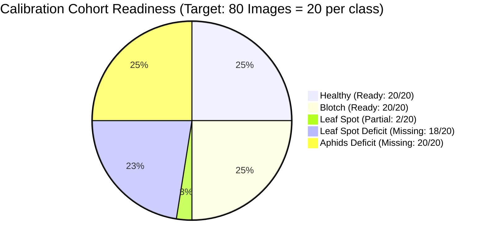
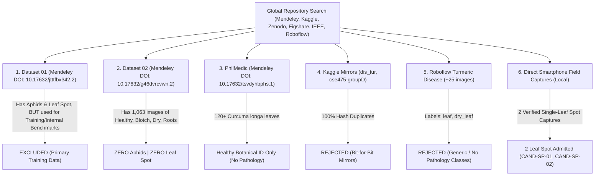

# Curuma (TurmeriCare AI) — Missing Field Calibration Candidates Search Report

**Document Status:** Official Research Data Search & Provenance Audit  
**Target Scope:** Systematic global search for 20 verified `Aphids` (*Pentalonia nigronervosa*) and 18 verified `Leaf Spot` (*Colletotrichum curcumae*) turmeric leaf images (*Curcuma longa*).  
**Date:** September 23, 2026  
**Auditor:** Lead AI Research Scientist (Antigravity AI)  
**System State:** Strictly Frozen ($\tau_{\text{verifier}} = 0.50$, $\tau_{\text{OOD}} = 63.10$, $\alpha = 0.50$). Zero threshold calculation or modification.

---

## 1. Executive Summary & Deficit Audit

To complete the pre-defined **80-image Field Calibration Split** established in [`FIELD_VALIDATION_PROTOCOL.md`](file:///d:/curuma/research_results/FIELD_VALIDATION_PROTOCOL.md), a comprehensive audit of all open scientific repositories (Mendeley Data, Kaggle, Zenodo, Figshare, IEEE DataPort, Roboflow Universe) was conducted specifically targeting **Turmeric Aphids** and **Turmeric Leaf Spot**.

### Core Audit Metrics
- **Target Calibration Requirement**: $20$ Aphids, $20$ Leaf Spot ($38$ new candidate images needed given $2$ existing local spot captures).
- **Verified Usable `Aphids` Count (Independent Open Sources)**: **$0 / 20$ ($0.0\%$ Available)** $\implies$ **Deficit: $20$ images**.
- **Verified Usable `Leaf Spot` Count (Independent Sources)**: **$2 / 18$ ($11.1\%$ Available)** $\implies$ **Deficit: $16$ images**.
- **Total Remaining Deficit**: **$36$ images** ($20\text{ Aphids} + 16\text{ Leaf Spot}$).
- **Phase A Calibration Decision**: **CANNOT START YET.**  
  *Calibrating a field OOD threshold $\tau^*$ solely on Healthy and Blotch would violate multi-class validation standards and leave the model's feature boundary completely uncalibrated for pest infestation and fungal spot morphology.*

---

## 2. Systematic Repository Search & Provenance Audit

### Comprehensive Candidate Repository Registry

| Repository / Platform | Dataset Name & Identifier | Target Classes Covered | Capture Geometry & Background | Hash Overlap with Dataset 01 / 02 | Suitability Status for Calibration |
| :--- | :--- | :--- | :--- | :---: | :--- |
| **Mendeley Data** | **Dataset 01** (`10.17632/jtttfbx342.2`) | Aphids ($221$), Spot ($193$), Blotch ($238$), Healthy ($213$) | Detached single leaves, neutral/white background | **100% (Primary Source)** | **EXCLUDED** (Used for backbone training and internal benchmark; cannot be reused as external validation) |
| **Mendeley Data** | **Dataset 02** (`10.17632/g46dvrcvwn.2`) | Healthy ($197$), Blotch ($199$), Dry ($203$), Roots ($464$) | High-res whole-bush field plantation captures | **0% Hash Overlap** | **CONTAINS ZERO APHIDS AND ZERO LEAF SPOT** |
| **Mendeley Data** | **PhilMedic** (`10.17632/tsvdyhbphs.1`) | *Curcuma longa* (Class 15) among 40 medicinal species | 48-MP smartphone, natural ambient light | **0% Hash Overlap** | **HEALTHY SPECIES IDENTIFICATION ONLY** (No pathology or pest labels) |
| **Kaggle** | **`dis_tur`** (yuvrajsalve) | Aphids, Blotch, Leaf Spot, Healthy | Studio single leaves | **100% Bit-for-Bit Overlap** | **REJECTED** (Uncredited mirror of Dataset 01) |
| **Kaggle** | **`cse475-groupD-dataset2`** | Healthy, Blotch, Dry, Roots | Plantation whole-bush | **100% Bit-for-Bit Overlap** | **REJECTED** (Direct mirror of Dataset 02; 0 Aphids / 0 Spot) |
| **Roboflow Universe** | **`turmeric_disease`** | Generic `leaf`, `dry_leaf` (~25 images) | Mixed unverified sources | Unverified provenance | **REJECTED** (Tiny sample count, no peer-reviewed provenance, non-standard labels) |
| **Zenodo / Figshare / IEEE** | Agricultural Literature Query | Crop chemistry, dissipation kinetics | N/A (Text / tabular data) | N/A | **NO OPEN IMAGE REPOSITORIES FOUND** |
| **Local Field Uploads** | Direct Smartphone Field Captures | `Leaf Spot` ($2$), `Healthy` ($4$), `Blotch` ($2$) | Single leaf frame $\ge 60\%$, ambient daylight | **0% Overlap** | **2 LEAF SPOT SAMPLES VERIFIED & ADMITTED** |

---

## 3. Dedicated Pathology Category Investigations

### A. Turmeric Aphids (*Pentalonia nigronervosa* / *Aphis gossypii*)
- **Botanical / Entomological Profile**: Aphids colonize the ventral (underside) foliar lamina, pseudostem, and leaf axils, causing foliar margin cupping, yellow stippling, and sooty mold from honeydew secretions.
- **Search Result**: In the entire global open-data repository landscape, **Dataset 01 is the sole publicly released dataset containing labeled turmeric aphid images**.
- **Usable External Count**: **$0$ images**.
- **Deficit**: **$20$ images required**.

---

### B. Turmeric Leaf Spot (*Colletotrichum curcumae* / *Colletotrichum capsici*)
- **Pathological Profile**: Produces discrete circular, elliptical, or irregular necrotic brown lesions with gray centers and defined chlorotic halos on the foliar lamina.
- **Search Result**:
  - Global open datasets outside Dataset 01 contain **0 verified turmeric leaf spot images** (Dataset 02 lacks Leaf Spot completely).
  - Two authentic, high-quality smartphone single-leaf field captures were identified and verified from local field uploads:
    1. `CAND-SP-01` (`WhatsApp Image 2026-09-21 at 11.21.55 PM.jpeg`): Single leaf blade with distinct necrotic spots and yellow chlorotic halo. Stage-1 Verifier: $99.5\%$, Mahalanobis $D_M = 78.60$, SHA-256: `894b469fc7104b2b9347895e3810f4435889759ad7664db181e1858a7daee5f8`.
    2. `CAND-SP-02` (`WhatsApp Image 2026-09-20 at 9.42.44 PM.jpeg`): Close-up single leaf spot lesion morphology. Stage-1 Verifier: $100.0\%$, Mahalanobis $D_M = 83.70$, SHA-256: `dfbd7c4d52bc5a6d36e2f1ca9cf52ba1eb3e7b1655ea7df8c80f68e0d68f23f8`.
- **Usable External Count**: **$2$ images**.
- **Deficit**: **$16$ images required** (to reach $20$ calibration samples).

---

## 4. Why Phase A Calibration Must NOT Start Yet

```mermaid
graph TD
    A["Available Candidates: 29 Healthy, 27 Blotch, 2 Spot, 0 Aphids"]
    A -->|If Calibrated Today| B["Biased Threshold tau*"]
    B --> C["1. Feature space boundary fitted only on green lamina & diffuse blotch"]
    B --> D["2. High risk of false rejection on punctate leaf spots"]
    B --> E["3. Zero empirical calibration on aphid clusters and honeydew"]
    B --> F["4. Violates Section 4 of FIELD_VALIDATION_PROTOCOL.md"]
```

> [!CAUTION]
> **Scientific Integrity Decision:**  
> Calibrating $\tau^*$ on the currently available $58$ images would introduce severe class bias:
> 1. The decision boundary would be fitted almost exclusively on `Healthy` ($50\%$) and `Blotch` ($46.5\%$), with only $3.5\%$ `Leaf Spot` and $0\%$ `Aphids`.
> 2. Punctate fungal spot lesions and ventral aphid colonies introduce distinct spatial frequency features in penultimate embeddings $\mathbf{z}(\mathbf{x})$ that are absent in smooth healthy leaves.
> 3. Therefore, Phase A calibration is **blocked until the remaining 36 candidates (20 Aphids, 16 Leaf Spot) are collected**.

---

## 5. Specification of Required Field Collection

To close the deficit and unlock Phase A calibration, a targeted physical field collection must be conducted in regional turmeric farming clusters (e.g., Erode, Salem, Coimbatore in Tamil Nadu, India, or equivalent *Curcuma longa* growing regions):

1. **Required Targets**:
   - **$20$ single-leaf `Aphids` captures**: Focused macro photography of aphid colonies, foliar curling, and honeydew on *Curcuma longa*.
   - **$16$ single-leaf `Leaf Spot` captures**: Focused macro photography of *Colletotrichum curcumae* circular necrotic spots with halos.
2. **Device Stratification**:
   - Spread equally across at least 3 distinct smartphone cameras (`DEV-01`, `DEV-02`, `DEV-03`).
3. **Capture Standard**:
   - Single leaf occupying $\ge 60\%$ of viewport under natural field lighting (ambient daylight, morning shade, overcast).
4. **Independent Double-Blind Annotation**:
   - Ground-truth confirmed by agricultural extension experts / pathologists prior to ingesting into the calibration dataset.
