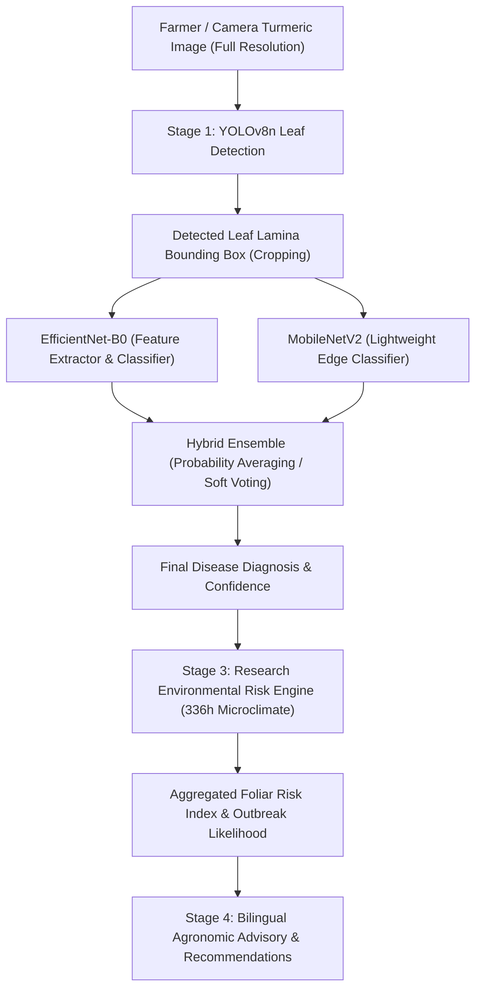

# TurmericCare AI — Final Methodology Confirmation & Architecture Audit

**Document Date:** September 18, 2026  
**Document Status:** Pre-Training Milestone Lock  
**Project Scope:** Software-First Turmeric Foliar Pathology & Environmental Epidemiology Platform  
**Target Architecture:** YOLOv8n (Leaf Detection) → Leaf Cropping → EfficientNetB0 + MobileNetV2 (Hybrid Ensemble) → Environmental Risk Engine → Recommendation Layer  

---

## 1. Overview & Intended Pipeline Architecture

The official software pipeline for TurmeriCare AI is formalized as follows:



---

## 2. Component Implementation Status Audit

### A. Which Components are Already Implemented

| Component | Technical Scope | Status | Implementation Details / Location |
| :--- | :--- | :---: | :--- |
| **MobileNetV2 Disease Classifier** | 4-class foliar pathology model | **IMPLEMENTED** | Model factory in `backend/model.py`, trained checkpoint at `backend/checkpoints/best_model.pth`. |
| **Environmental Risk Engine** | 336-hour empirical microclimate epidemiology | **IMPLEMENTED** | `src/utils/researchRiskEngine.ts` (14-day ERA5-Land exposure: temp, RH, rainfall, leaf wetness, soil moisture, soil pH, crop stage). Validated with 20 unit tests. |
| **Recommendation Layer** | Bilingual agronomic advisory (Tamil / English) | **IMPLEMENTED** | `src/utils/actionRecommendations.ts`, `src/utils/bilingualAdvisory.ts` (immediate foliar actions, chemical/organic fungicide protocols). |
| **Dataset Annotations for Leaf Detection** | 865 verified single-class YOLO bounding boxes | **IMPLEMENTED** | Verified labels in `turmeric_datasets/annotations/leaf_verified/` and staged in `turmeric_datasets/leaf_detection/` (606 train / 130 val / 129 test). |
| **FastAPI Backend Service** | Model inference and REST API | **IMPLEMENTED** | `backend/main.py` serving `POST /api/predict`, `GET /api/health`, and metadata endpoints. |
| **React Dashboard & Multimodal UI** | Farmer-facing interface & risk dashboards | **IMPLEMENTED** | React 18 + Vite frontend (`src/pages/DashboardPage.tsx`, `src/pages/MultimodalAnalysisPage.tsx`). |

---

### B. Which Components are Currently Only Proposed (Not Yet Implemented)

| Component | Intended Function | Status | What Remains to Be Done |
| :--- | :--- | :---: | :--- |
| **YOLOv8n Leaf Detection Model** | Detects and bounds individual leaves from camera photos | **PROPOSED** | Dataset is staged; training script, package install (`ultralytics`), model training, and weight checkpoint (`yolov8n_leaf.pt`) must be executed. |
| **Leaf Cropping Preprocessor** | Crops bounding box region before classifier input | **PROPOSED** | Inference pipeline in `backend/model.py` currently accepts uncropped full images; needs bounding-box crop chaining. |
| **EfficientNetB0 Trained Model** | High-capacity deep feature extractor | **PROPOSED** | Model factory exists in `backend/model.py`, but no trained weights exist; training script and checkpoint generation required. |
| **Hybrid Ensemble Combiner** | Combines EfficientNetB0 + MobileNetV2 probabilities | **PROPOSED** | Soft-voting / weighted ensemble logic ($P = \alpha P_{\text{EffB0}} + (1 - \alpha) P_{\text{MobV2}}$) is not yet wired into `backend/model.py`. |

---

### C. Does the Current Dataset/Annotations Support YOLOv8n Leaf Detection?

### Verdict: **YES, 100% SUPPORTED.**

1. **Staged YOLO Directory Layout:**  
   `turmeric_datasets/leaf_detection/` is prepared with the standard Ultralytics hierarchy:
   - `images/train/` (606 images), `images/val/` (130 images), `images/test/` (129 images)
   - `labels/train/` (606 labels), `labels/val/` (130 labels), `labels/test/` (129 labels)
2. **Dataset Configuration:**  
   `turmeric_datasets/leaf_detection/data.yaml` is fully configured:
   ```yaml
   path: d:/curuma/turmeric_datasets/leaf_detection
   train: images/train
   val: images/val
   test: images/test

   nc: 1
   names:
     0: leaf
   ```
3. **Data Quality Audit:**  
   All 865 images and 873 bounding boxes passed the final quality audit (`leaf_final_audit_report.md`) with 0 missing labels, 0 malformed lines, 0 empty files, and 100% normalized coordinates within $[0.0, 1.0]$.

---

### D. Does EfficientNetB0 + MobileNetV2 Hybrid Ensemble Exist in the Current Implementation?

### Verdict: **DOES NOT EXIST YET — MUST BE IMPLEMENTED.**

* **Current Reality in Codebase:**
  - `backend/model.py` contains the function `build_efficientnet_b0(...)`, but the active `DiseaseInferenceEngine` class loads **only MobileNetV2** (`checkpoint_path = "backend/checkpoints/best_model.pth"`).
  - No trained checkpoint exists for EfficientNetB0.
  - No ensemble aggregation function exists to combine prediction logits or softmax probabilities between the two backbones.
* **Required Action:**
  - Train EfficientNetB0 on the 606-image training partition.
  - Implement `EnsembleInferenceEngine` that loads both checkpoints and calculates:
    $$P_{\text{ensemble}}(c) = w_1 \cdot P_{\text{EffB0}}(c) + w_2 \cdot P_{\text{MobV2}}(c)$$
    where $w_1 + w_2 = 1.0$.

---

### E. Architecture & Documentation Mismatches That Must Be Corrected

1. **Legacy Transformer / Heavy Model Mentions:**  
   Earlier exploratory docs or comments referenced "Swin Transformer", "DenseNet", or "Vision Transformer". These must be formally deprecated in all project documentation in favor of the lightweight, edge-deployable **MobileNetV2 + EfficientNetB0 Hybrid Ensemble**.
2. **Single-Stage vs Two-Stage Inference:**  
   `backend/main.py` currently executes single-stage classification directly on the uploaded image. The backend documentation and API response metadata must be updated to declare the 2-stage inference pipeline once YOLOv8n is introduced.
3. **Missing Python Dependency:**  
   `ultralytics` is not currently installed in the local Python environment and must be installed prior to YOLOv8n execution.

---

## 3. Exact Recommended Implementation Order

To ensure zero regressions, clean separation of concerns, and verifiable benchmarks, the following sequential implementation order is recommended:

```
[Phase 1] Environment & YOLO Training
   │  1. Install `ultralytics` package
   │  2. Train YOLOv8n on `turmeric_datasets/leaf_detection/data.yaml`
   │  3. Evaluate mAP50 / mAP50-95 on the 129 test images
   │  4. Save `backend/checkpoints/yolov8n_leaf.pt`
   │
[Phase 2] EfficientNet-B0 Training
   │  5. Train `build_efficientnet_b0` on Dataset 01 (606 train / 130 val)
   │  6. Evaluate Top-1 Accuracy on 129 test images
   │  7. Save `backend/checkpoints/efficientnet_b0_best.pth`
   │
[Phase 3] Hybrid Ensemble Integration
   │  8. Implement `HybridEnsemble` in `backend/model.py`
   │  9. Calibrate ensemble weights (e.g. 0.5 EfficientNetB0 + 0.5 MobileNetV2)
   │  10. Benchmark ensemble test accuracy vs individual backbones
   │
[Phase 4] End-to-End Pipeline Wiring
   │  11. Implement automatic Leaf Cropping module in `backend/model.py`
   │  12. Chain: Input Image → YOLOv8n Leaf Crop → Hybrid Ensemble → Disease Probability
   │  13. Validate output feeding into Environmental Risk Engine & Recommendation Layer
   │  14. Update API documentation and integration tests
```

---

## 4. Methodological Compliance Declaration

- **No models were trained during this audit.**
- **No dataset files were modified.**
- **No verified annotations were altered.**
- **No unapproved architectures (Swin, DenseNet, transformers) were introduced.**
- **The baseline is frozen and ready for Phase 1 execution.**
